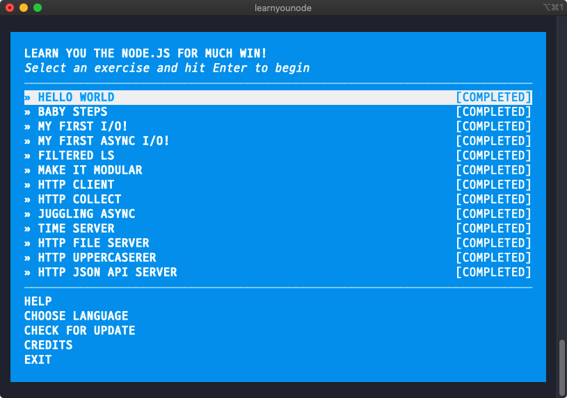

# LearnYouNode

Node.js basic tutorial **learnyounode** from [NodeSchool](https://nodeschool.io/)

> [https://github.com/workshopper/learnyounode](https://github.com/workshopper/learnyounode)



## 01. HELLO WORLD [🔗](./hello-world.js)

> make Node.js program

### # execute program

- create a new file with a .js extension
- running it with the node command

```bash
$ node hello-world.js
```

## 02. BABY STEPS [🔗](./baby-steps.js)

> access command-line arguments

### # process object : argv property

- `process.argv` : an array containing the complete command-line
- all elements of `process.argv` are strings

```bash
$ node command-line-test.js 1 2 3
```

```js
console.log(process.argv); // ['node', '/path/to/your/command-line-test.js', '1', '2', '3']
```

## 03. MY FIRST I/O! [🔗](./my-first-io.js)

> synchronous filesystem operation

### # fs module

- Node core library
- all synchronous (or blocking) filesystem methods in the fs module end with `Sync`
- `fs.readFileSync('/path/to/file')` : read a file synchronous, returns a Buffer object
  - supply `utf8` as the second argument : returns String instead of a Buffer
- Buffer objects can be converted to strings by calling the `toString()` method

## 04. MY FIRST ASYNC I/O! [🔗](./my-first-async-io.js)

> asynchronous filesystem operation

### # fs module - readFile

- `fs.readFile('/path/to/file', callback)` : read a file asynchronous
- callback signature : `function callback (err, data) { /* ... */ }`, `data` is a Buffer object
- supply `utf8` as the second argument and put the callback as the third argument : `data` is a String instead of a Buffer

## 05. FILTERED LS [🔗](./filtered-ls.js)

> list of files

### # fs module - readdir

- `fs.readdir('/path/to/dir', callback)` : read the contents of a directory asynchronous
- callback signature : `function callback (err, list) { /* ... */ }`, `list` is an array of filename strings

### # path module

- Node core library
- `extname` method : returns the extension of the path (ex. `.md`)

## 06. MAKE IT MODULAR [🔗](./make-it-modular.js)

> module system

### # create module

- to define a single function export : `module.exports = function (args) { /* ... */ }`
- to use new module : `const mymodule = require('./mymodule.js')`

## 07. HTTP CLIENT [🔗](./http-client.js)

> HTTP GET request

### # http module

- Node core library
- `http.get(url, callback)` : performs an HTTP GET request
- callback signature : `function callback (response) { /* ... */ }`, `response` object is a Node Stream object
- Node Stream
  - emit events like `'data'`, `'error'`, `'end'` ... : `response.on('data', function (data) { /* ... */ })`
  - has `setEncoding()` method : `response.setEncoding('utf-8')`

## 08. HTTP COLLECT

> collect data across multiple events

### # bl(Buffer List) module / concat-stream module

- both have a stream piped in to them and will collect the data
- `response.pipe(bl(function (err, data) { /* ... */ }))`
- `response.pipe(concatStream(function (data) { /* ... */ }))`
- `data` is a Buffer object

## 09. JUGGLING ASYNC

> collect data from multiple URLs in sequence

### # more convenient

- [`async`](https://www.npmjs.com/package/async)
- [`run-parallel`](https://www.npmjs.com/package/run-parallel)

## 10. TIME SERVER

> write a TCP time server

### # net module

- Node core library
- `net.createServer(listener)` : create raw TCP server, returns an instance of server
- listener signature : `function listener (socket) { /* ... */ }`
- `socket` object : a Node duplex Stream, can be both read from and
  written to
  - `socket.write(data)` : write data to the socket
  - `socket.end()` : close the socket
  - `socket.end(data)` : write data and close the socket
- must call `server.listen(portNumber)` to start listening on a particular port

```js
/* A typical Node TCP server */
const net = require('net');
const server = net.createServer(function (socket) {
  // socket handling logic
});
server.listen(8000);
```

### # create date - `new Date()` object

- `date.getFullYear()`
- `date.getMonth()` // starts at 0
- `date.getDate()` // returns the day of month
- `date.getHours()`
- `date.getMinutes()`

## 11. HTTP FILE SERVER

> HTTP server that serves file

### # http module - create server

- `http.createServer(callback)` : create an HTTP server, returns an instance of server
- callback signature : `function callback (request, response) { /* ... */ }`
- `request`, `response` : Node streams
- must call `server.listen(portNumber)` to start listening on a particular port

### # fs module - createReadStream

- `fs.createReadStream(file)` : create a stream representing the file, returns stream object
- `src.pipe(dst)` : pipe the data from the `src` stream to the `dst` stream

## 12. HTTP UPPERCASERER

> HTTP POST request

### # through2-map package

- `map` function : create a transform stream data
- takes a chunk of data and returns a chunk of data

```js
/* a chunk character reverser */
const map = require('through2-map');
inStream
  .pipe(
    map(function (chunk) {
      return chunk.toString().split('').reverse().join('');
    })
  )
  .pipe(outStream);
```

## 13. HTTP JSON API SERVER

> HTTP server that serves JSON data

### # url module

> "route" requests for endpoints

- Node core library
- `new URL(url)` : parse content of `url` and provide an object with helpful properties

```bash
$ node -pe "new URL('/test?q=1', 'http://example.com')"
```

### # JSON data

- `JSON.stringify()` : converts a JavaScript object or value to a JSON string
- set Content-Type : `res.writeHead(200, { 'Content-Type': 'application/json' })`

### # Date

- `new Date().toISOString()` : print dates in ISO format
- `new Date().getTime()` : get UNIX epoch time in milliseconds
